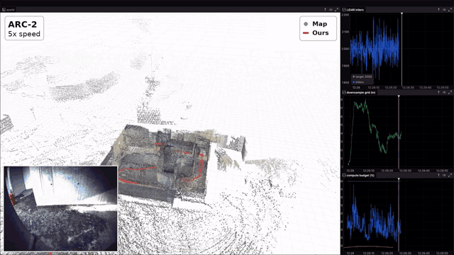
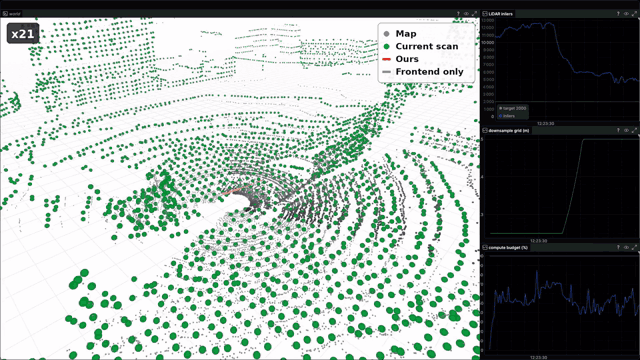

# SE(3)-LIVOM for the COMFORT Localization Benchmark

Our entry to the COMFORT Localization Benchmark (GrandTour, IROS 2026 Data in Field Robotics workshop):
multi-LiDAR-inertial-visual odometry on SE(3) with an online backend, built on
[se3-lio](https://github.com/url-kaist/se3-lio), [FAST-LIVO2](https://github.com/hku-mars/FAST-LIVO2)
(photometric update), [HBA](https://github.com/hku-mars/HBA) (plane BA, vendored under
`src/se3-lio/cpp/se3_lio/backend/`) and [GTSAM](https://github.com/borglab/gtsam) (iSAM2). GPL-2.0.

<table align="center">
  <tr>
    <td align="center"><a href="https://youtu.be/KeFDiszek7g"></a></td>
    <td align="center"><a href="https://youtu.be/2fzHPVpcxvc"></a></td>
  </tr>
  <tr>
    <td align="center"><sub><a href="https://youtu.be/KeFDiszek7g">▶ Real-time run on the six Test missions</a></sub></td>
    <td align="center"><sub><a href="https://youtu.be/2fzHPVpcxvc">▶ Adaptive downsampling on ARC-2</a></sub></td>
  </tr>
</table>

## Build

```bash
bash docker/build_docker.sh      # image comfort:ros1
```

## Run

```bash
export DATA=/path/to/grandtour   # folder with the mission folders <id>_<MISSION>_release_<date>/ and their bags
bash scripts/run.sh arc-2 frontend   # frontend only (submission 933011)
bash scripts/run.sh arc-2            # frontend + backend (submission 935484, the leaderboard entry)
```

The container runs with `--cpus=8 --memory=16g` (`CPUSET=<cores>` pins it, e.g. the P-cores of an i9-13900 in
our runs). Per-mission IMU time offsets are in `src/se3-lio/config/imu_dt.yaml`; all options are in
`scripts/run_se3lio.sh`.

Output: `results/<seq>-se3lio-multi-livo-ad-n2000[-backend]-rt-online/<seq>.tum` (frontend, prism frame)
and `<seq>_backend_prism.tum` (backend). These files, renamed `<seq>.tum`, are the submission.

The prism frame comes from `tools/to_prism.py`: `T_imu_prism` of the mission's `/tf_static` plus a constant
lever-arm correction of (-5.7, 1.8, -11.4) mm in the IMU frame, fitted once on the six Validation missions and
applied unchanged to every mission.

## Evaluate

```bash
bash docker/run_docker.sh python3 tools/eval.py results/<name>/<seq>.tum <gt.tum>   # same ATE rule as the Codabench scorer
```

`<gt.tum>` is the prism ground truth of a Validation mission (`tools/extract.py <mission_dir>` writes it to
`<mission_dir>/comfort_offline/gt.tum`).

## References

| used for | code | paper |
|---|---|---|
| frontend (SE(3) filter) | [url-kaist/se3-lio](https://github.com/url-kaist/se3-lio) | Shin et al., ICRA 2026 |
| voxel map | [hku-mars/VoxelMap](https://github.com/hku-mars/VoxelMap) | Yuan et al., RA-L 2022 |
| photometric update, LIO parameters | [hku-mars/FAST-LIVO2](https://github.com/hku-mars/FAST-LIVO2) | Zheng et al., T-RO 2024 |
| backend plane BA | [hku-mars/HBA](https://github.com/hku-mars/HBA) | Liu et al., RA-L 2023 |
| backend pose graph (iSAM2) | [borglab/gtsam](https://github.com/borglab/gtsam) | Kaess et al., IJRR 2012 |
| evaluation | [MichaelGrupp/evo](https://github.com/MichaelGrupp/evo) | |
